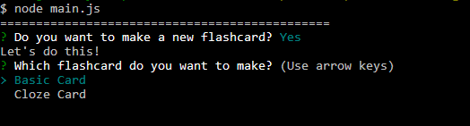
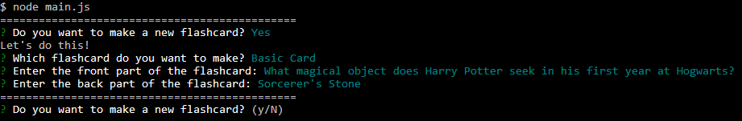
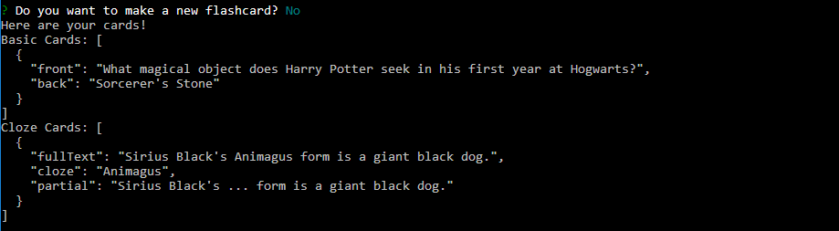

# Flashcard-Generator
Created the backend for a flashcard application using Node.js and constructors. The NPM module Inquirer was used to interact with the user within the CLI environment. 

There are two types of flashcards that can be created and examples for each:
* Basic Flashcard - User enters the front and back information for each card.
	* Front: What magical object does Harry Potter seek in his first year at Hogwarts?
	* Back: Sorcerer's Stone
* Cloze Flashcard - User enters the full text of the flashcard and provide the cloze information that will be replaced in the partial text.
	* Full text: Sirius Black's Animagus form is a giant black dog.
	* Cloze: Animagus
	* Partial: Sirius Black's ... form is a giant black dog.

**Technology / Concepts used:** Node.js, Constructors, Inquirer, and JavaScript.

- - -

Below are screenshots demonstrating the application:
##### Application start

##### Basic Card

##### Cloze Card

##### Card Results
